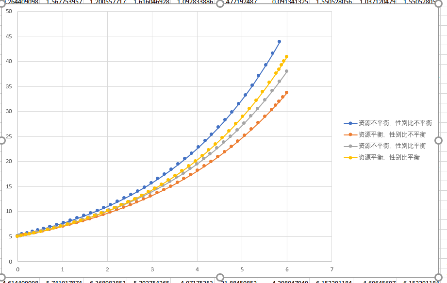

对于资源分配平衡的环境，我们设置$\alpha_P = 0.7, \alpha_U = 0.7, \gamma = 1$，对于资源分配不平衡的环境，我们设置$\alpha_P = 1, \alpha_U = 0.4, \gamma = 4$。性别比平衡的设置为$M_{BP} = 0.5, M_{BU} = 0.5$，性别比平衡的设置为$M_{BP} = 0.8, M_{BU} = 0.4$。这些设置都能较好的反应自然界的真实情况。
图表种，在我们模型的理想环境下，四种设置的七鳃鳗种群数量均随时间增长。值得注意的是，在资源不平衡的环境中，出生性别比不平衡的七鳃鳗种群取得了数量上的优势。而在资源分类平衡的环境中，出生性别比平衡的七鳃鳗种群取得了数量优势。
在现实环境中，七鳃鳗的出生性别比是不平衡的。在productive环境中，七鳃鳗的性别比大致为1，在unproductive的环境中，雄性七鳃鳗的数量多于雌性七鳃鳗。
我们认为，七鳃鳗可变化的性别比是为了适应不同环境资源量的不同。将多数资源分配给雌性，以提高种群整体的繁殖能力，这是七鳃鳗性别比变化对于七鳃鳗人口的优势。但是如果在一个资源分配平均环境中，七鳃鳗不平衡的性别比将成为其生存的劣势。