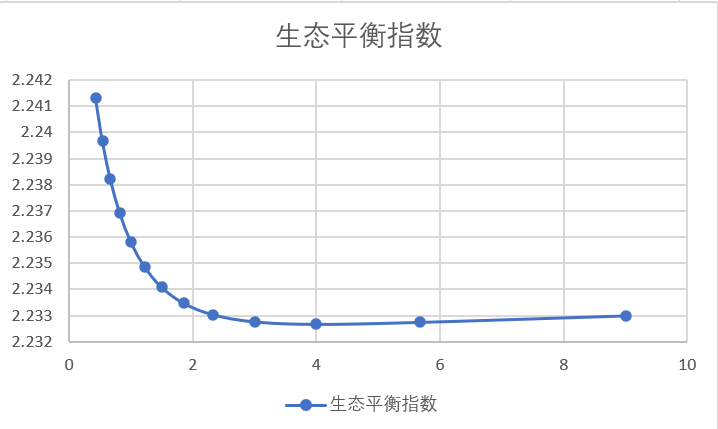

通过调查和设置合理的参数，借助MATLAB仿真，我们获得了生态系统稳定性随七鳃鳗性别比变化的趋势。它们的值显示在以上图表中。
观察图表可以看出，随着性别比由小增大，生态系统稳定度骤降。随后，在性别比大致为4（雄性占比80%）时达到最低点。最后生态系统稳定性趋于平稳并缓慢上升。
通过分析实验过程中的数据，我们发现七鳃鳗作为寄生生物，对环境稳定性的影响往往是负面的。其几乎没有杀死环境中优势物种以达到各物种间平衡的作用。相反，仿真试验结果表明，随着七鳃鳗性别比变化，当七鳃鳗种群密度增加时，环境稳定性也随之下降。
我们的模型表明七鳃鳗的密度是影响环境稳定性的主要因素，有关部门应该控制七鳃鳗数量，或使用某些手段使七鳃鳗性别比远离"4"这一极值点，以达到增加环境稳定性的目的。