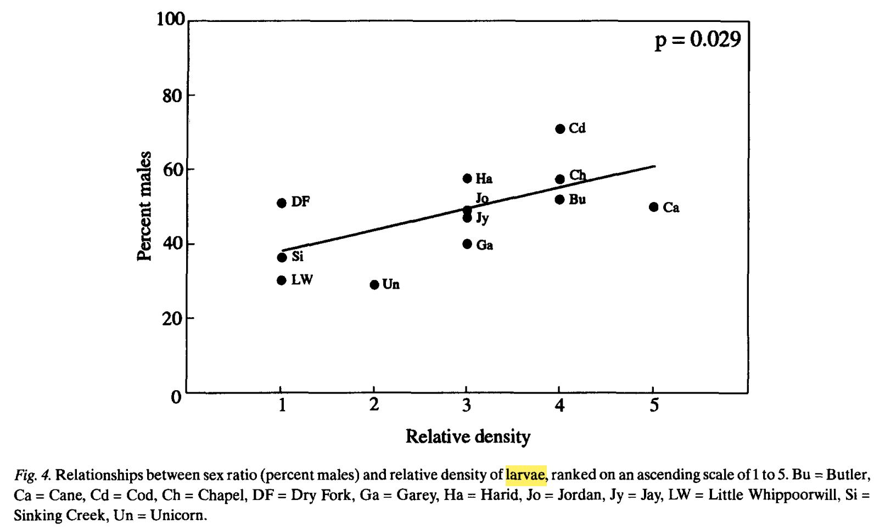
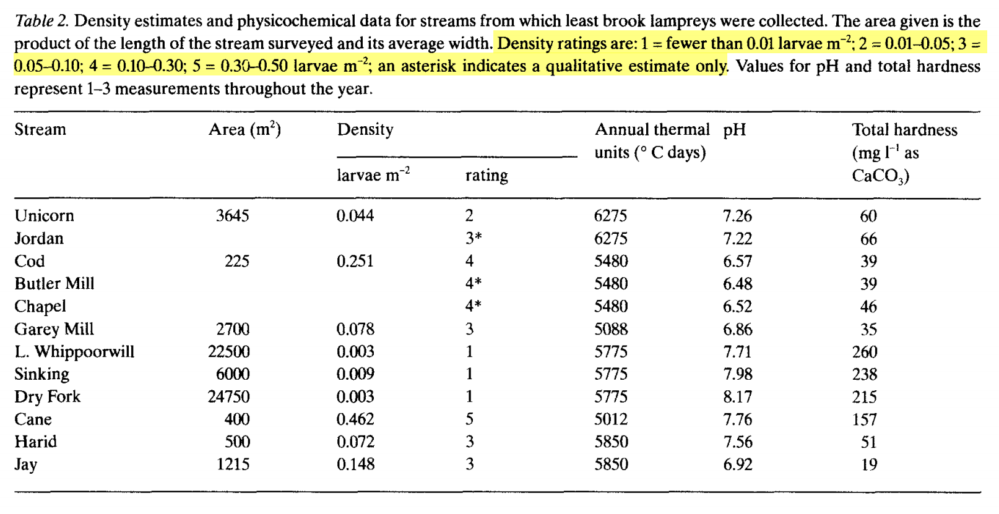
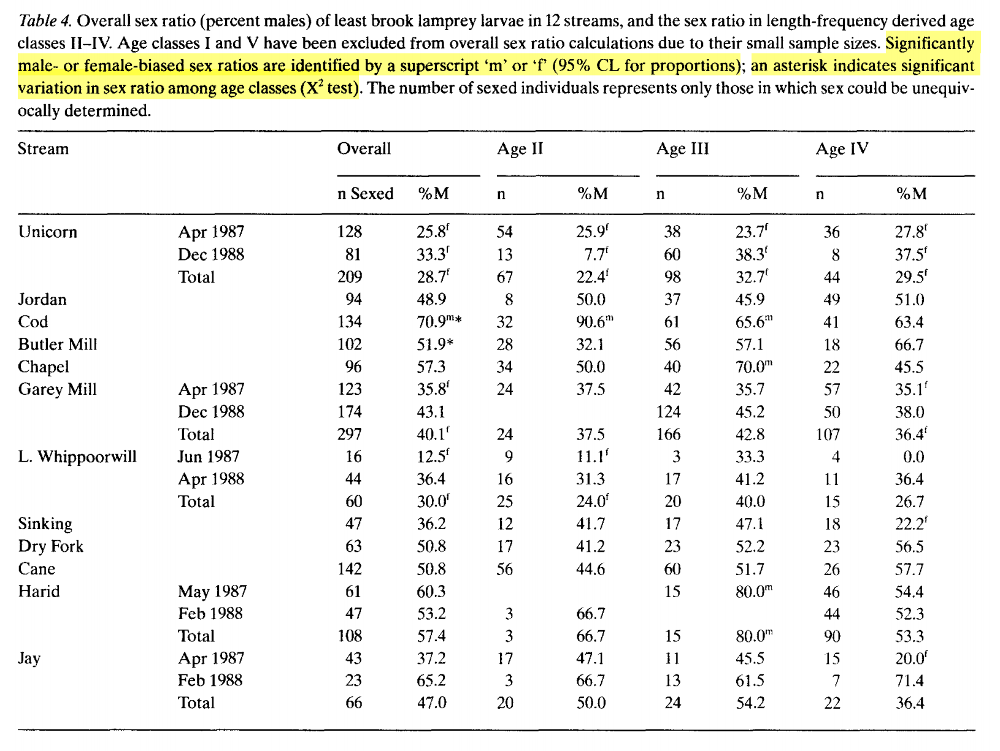

# Age, growth, and sex ratio among populations of least brook lamprey, Lampetra aepyptera, larvae: an argument for environmental sex determination

## 幼虫密度与性别比有关联，成年个体密度与性别比无明显关联

## 幼体密度

## 各溪流中各年龄性别比

