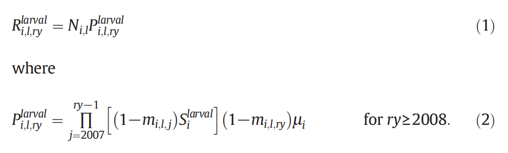
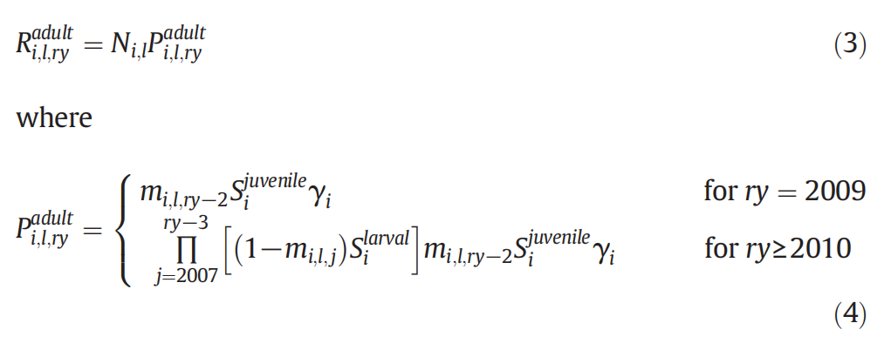
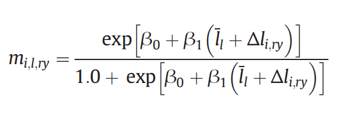
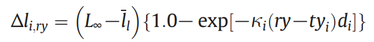

# Survival and metamorphosis of larval sea lamprey (Petromyzon marinus) residing in Lakes Michigan and Huron near river mouths

用了标记重补法
$$
R:预期回收的幼虫数量 \\
N:某一类别标记的幼虫数量 \\
P:在下药区域幼虫的回收概率 \\
P下药区回收概率 = \prod_{没下药的年份} 不变态概率 \times 生存概率 \prod_{最后一年年份} 不变态概率 \times 捕获概率 \\
如果下药了，最后再乘个0.25
$$
- **假设**：估计幼年存活率s为0.627，参考文献《Survival and metamorphosis of larval sea lamprey (Petromyzon marinus) residing in Lakes Michigan and Huron near river mouths》

- $R：成鱼期望回收个数 = 标记成鱼个数 \times 成鱼回收概率$
- $P成鱼回收概率 = 未变态概率 \times 未成年生存概率 \times 变态概率 \times 成年生存概率 \times 捕获概率$
- **假设**成年生存率为1（咋圆过去？）

- 逻辑斯蒂模型，引参考文献：https://www.sciencedirect.com/science/article/abs/pii/S0380133013001846
- m：变态概率
- $\beta_0 = −23.886、\beta_1 = 0.186：参数$
- $\bar{l}：长度区间的中点（我们用平均/中位数长度代替（如果有数据的话））$
- $\Delta l：某年预期的长度变化量$引用 von Bertalanffy growth equation

- $L_{\infty}$：**假设**：估计$L_{\infty}$等于 159 mm 引三篇文章来论证
    - https://www.sciencedirect.com/science/article/abs/pii/S0380133008715880
    - https://benthamopen.com/ABSTRACT/TOFISHSJ-2-59
    - https://www.sciencedirect.com/science/article/abs/pii/S0380133013001846
- d：对特定溪流的成长季时长（growing season duration）**假设**：估计为188 days，引用一篇来证明https://www.sciencedirect.com/science/article/abs/pii/S0380133003704845
- k：**假设**：估计为身体生长参数，1/days，参考文献《Survival and metamorphosis of larval sea lamprey (Petromyzon marinus) residing in Lakes Michigan and Huron near river mouths》
- ty：标记年份，相当于出生年份
- ry：捕捉年份，相当于观测年份（今年）