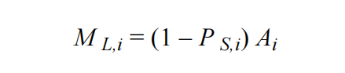
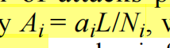

# Sea Lamprey (Petromyzon marinus) Parasite-host Interactions

$$
\begin{align*}
&a_i：寄生生物对第i种宿主的攻击次数\\
&F：进食季节长度\\
&N_i：第i种宿主的密度\\
&\lambda_i：对第i种宿主的有效搜索率\\
&h_i：第i种宿主附着时间
\end{align*}
$$

- **假设**：所有物种的h都相同（不会造成极端影响）
    - 引用：Although handling times will really vary among host types, this assumption is not as extreme as it first appears because it is applied only to the larger host species that form a substantial portion of the diet during the summer and autumn feeding season that is being modeled. **《Sea Lamprey (Petromyzon marinus) Parasite-host Interactions》**
- **假设**：$F = 0.41, h = 0.0548$ 引用：http://www.glfc.org/pubs/SpecialPubs/Sp89_1.pdf

$$
\begin{align*}
&M_i：攻击瞬间死亡率（年死亡率）\\
&A_i：每个宿主平均受攻击次数（年受攻击次数）\\
&P_s：宿主每次受攻击生存率
\end{align*}
$$
**假设**：$P_s=0.25$ 引用：https://cdnsciencepub.com/doi/abs/10.1139/f80-243

$$
\begin{align*}
&A_i：每个宿主平均受攻击次数（年受攻击次数）\\
&L：七鳃鳗数量（密度）\\
&N_i：第i种宿主的密度
\end{align*}
$$