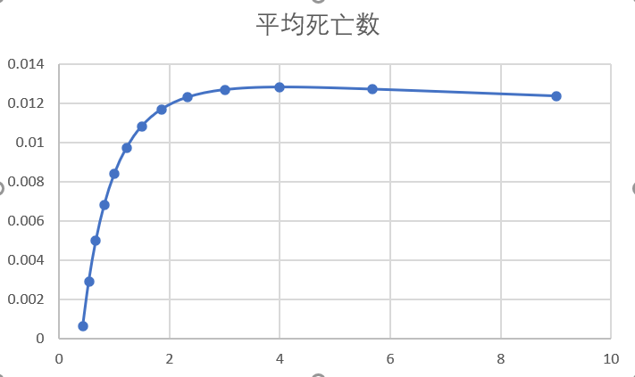

在本章中，我们对七鳃鳗性别比对更广泛生态环境的影响进行了深入研究。首先，我们通过拟合七鳃鳗性别比与其幼虫密度之间的关系，探讨了性别比对幼虫密度的影响。接着，我们基于七鳃鳗的生命周期，推导了幼年七鳃鳗到成年七鳃鳗的转化率。最终，我们根据五大湖中各类鱼类的数据，计算了七鳃鳗寄生对各鱼类死亡率的影响。

我们的研究结果表明，在性别比接近4附近时，鱼类的平均死亡率呈最高水平。这表明在该性别比条件下，七鳃鳗具有较强的繁殖能力和较高的种群密度，从而导致鱼类受到七鳃鳗寄生的增加。鱼类的质量与长度也是影响死亡率的重要因素。